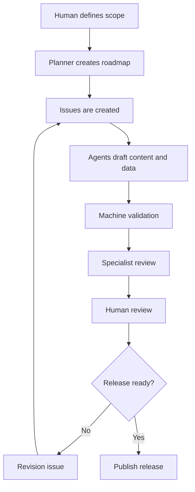

# Production Process

## Overview

The project uses an issue-driven and PR-driven workflow.
AI agents help produce drafts, but human review controls publication.

## Phases

1. Scope definition
2. Curriculum mapping
3. Lesson template confirmation
4. Issue creation
5. AI-assisted drafting
6. Machine validation
7. Specialist review
8. Human review
9. Release
10. Continuous revision

## MVP target

- Stage: High school
- Subject: Information I
- Unit: Programming Basics
- Lesson sample: Variables and Assignment

## Definition of done

A lesson is done only when:

- Student material exists.
- Teacher guide exists.
- Problem records exist.
- Answer records exist.
- Rubric records exist.
- Source records exist if needed.
- Revision records exist.
- Validation passes.
- Human review is complete.
