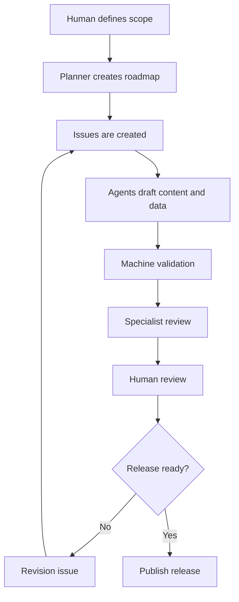

# Production Process

## Overview

The project uses an issue-driven and PR-driven workflow.
AI agents help produce drafts, but human review controls publication.

## Phases

1. Scope definition
2. Curriculum mapping
3. Lesson template confirmation
4. Issue creation
5. AI-assisted drafting
6. Machine validation
7. Specialist review
8. Human review
9. Release
10. Continuous revision

## Current Review-Candidate Target

- Stage: High school
- Subject: Information I
- Scope: all four provisional content areas
- Curriculum: 4 units and 32 planned lessons
- Delivery: Japanese learner lessons, supplemental teacher guides, aligned
  assessment records, offline HTML, and reproducible print/PDF output

The measurable scope and current baseline are defined in
`docs/INFORMATION_I_COMPLETION_MATRIX.md`. Earlier programming-only MVP documents
remain useful for C2 through C4 but no longer define subject-wide completeness.

## Definition of done

A lesson package is ready for final human review only when:

- Student material exists.
- Teacher guide exists.
- Problem records exist.
- Answer records exist.
- Rubric records exist.
- Source records exist if needed.
- Revision records exist.
- Validation passes.
- Specialist review has no unresolved machine-detectable or clearly actionable
  blocker.

Final human review, approval, merge, and any publication decision remain separate
gates. A completed draft package is not automatically approved or published.
